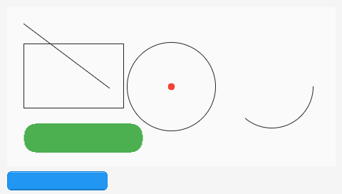
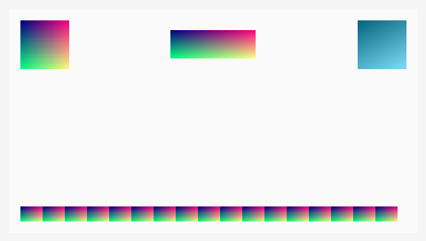
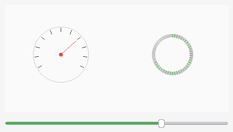
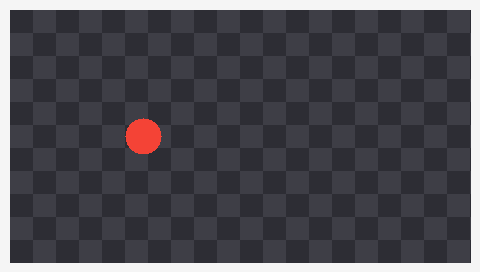
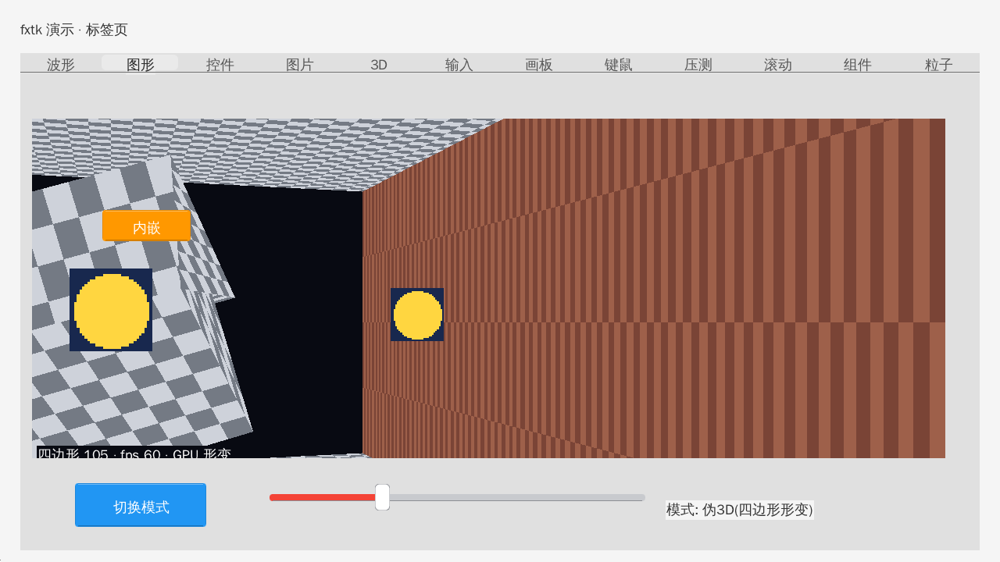
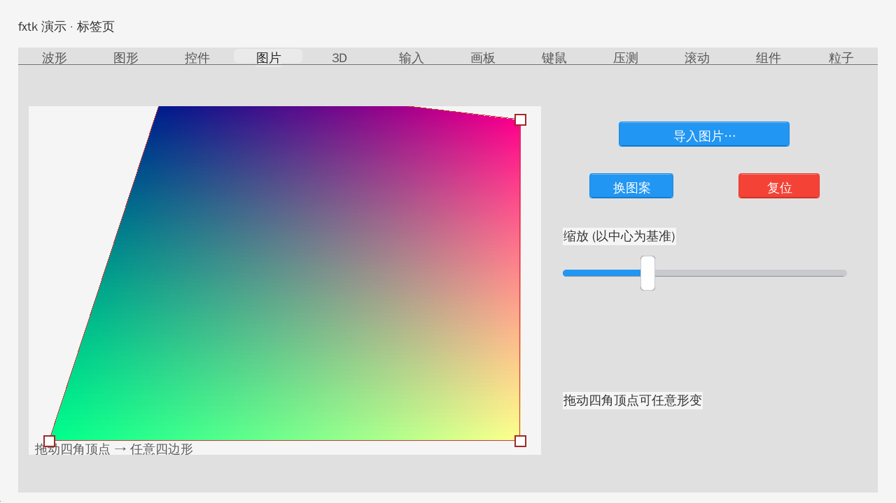
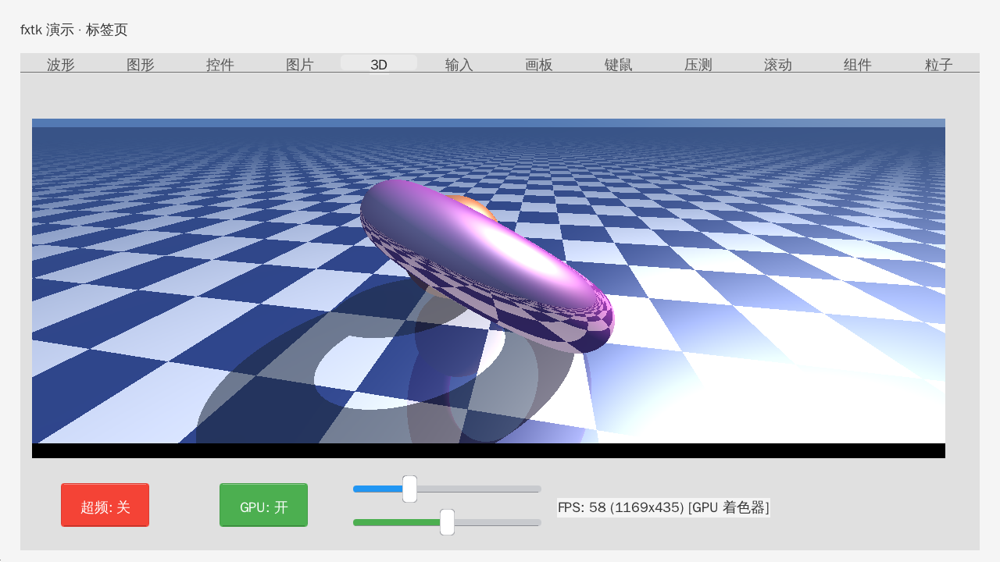
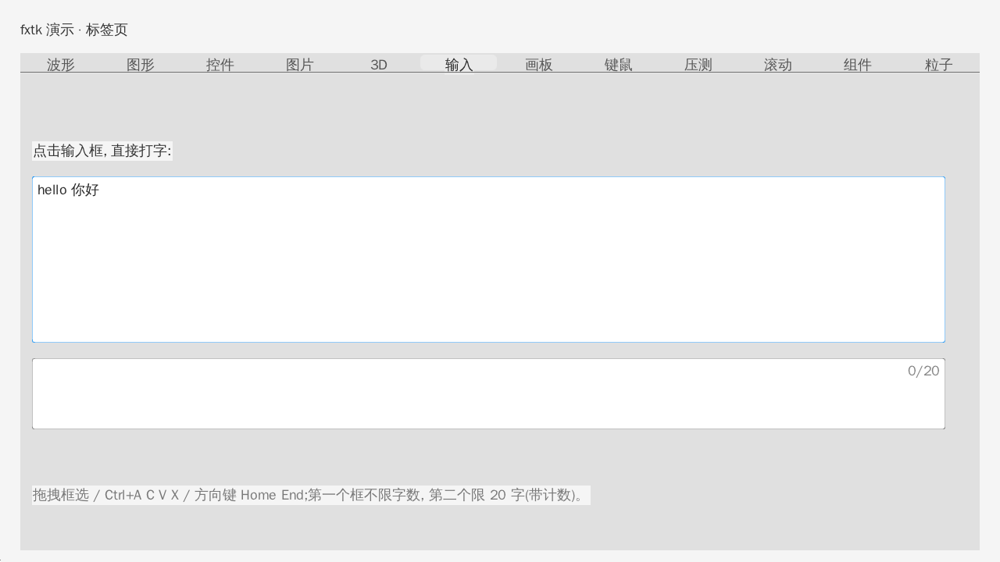

# fxtk — 轻量GUI框架 (v2.4)

<p>
  
  
  
  
</p>

**一个单帧、脏区重绘、属性宏驱动的 C GUI 框架**——核心纯 C、热路径零分配、480×272 响应式设计、
一份头文件就能上手。PC 默认走 **sokol(OpenGL)**，ESP32 用 `fx_driver_t` 抽象，几乎零改动跨平台。

**画布与抗锯齿（v2.2 无头渲染示意图）**：
| 抗锯齿 `fx_set_aa(1)` | 渐变 `fx_fill_rect_gradient` | 自定义控件（仪表盘） | 棋盘格（缩放安全） |
|---|---|---|---|
|  |  |  |  |

> 注：以上 v2.2 示意图由 `demo-main/test/render_canvas.c` **无头渲染**（不加载字体），只展示图形/渐变/边缘平滑；
> 按钮文字、数值等标签在**真实运行时有**（渲染工具为保持无头把文字函数桩掉了）。完整含文字界面见下方 demo 截图。

完整演示（12 页）见下方 demo 截图：
   

## v2.4 新增

- **默认后端换成 sokol**(OpenGL), SDL2 降为遗留对照。因此 Windows 版是**单 exe、无第三方 DLL**;
  SDL 代码保留只为"无头假驱动"给基准与金图回归用(CI 没有显示器)。
- **GPU 真透视四边形形变** `fx_draw_image_quad()`:每角透视权重进 `gl_Position.w`, 单次 draw 即透视正确
  —— 没有"两个三角形各做仿射"的对角缝。图片页可直接玩:导入 → 缩放 → 拖四角手柄 → 复位。
- **伪 3D 演示**(图形页第 4 模式):地板/天花板、走廊砖墙、旋转纹理立方体、公告板精灵全部由四边形形变拼出,
  HUD 显示四边形数 / fps / 走的哪条路径。
- **GPU 实时光线步进** `fx_raymarch_available()` / `fx_draw_raymarch()`:片元着色器直接算, 不占 CPU 像素、不回读。
- **设计令牌** `components/fxtk/fxtk_tokens.h`:控件颜色/圆角/留白集中一处, 改一处即可统一换肤。
- **后端服务层** `fxtk_backends.h`:随机(PCG32 可复现)/时间/路径/文件/图片解码(PNG·JPEG·BMP·GIF·TGA·PNM)/
  PNG 编码/剪贴板/文件对话框/偏好/能力协商;`-DFXTK_BACKEND_STUB` 提供确定性变体。
- **canvas 变换栈** `fx_canvas_push_affine/pop_affine` + `fx_fill_quad`:push 后矩形填充变实心四边形、图片走透视。
- **验证体系**:`make test`(双后端)/ `make golden`(金图, 进 CI)/ `make esp32-smoke`(进 CI)/ `make bench`;
  截图 `fx_screenshot()` 走驱动的 `read_pixels`, 零外部依赖。
- 注意:控件层 SDF 抗锯齿目前**默认关闭**(`s_widget_aa = 0`), 可用 `fx_set_widget_aa(1)` 或 `FXTK_AA=1` 开启
  —— 它在"画布 + 文字 + quadwarp 混排"场景下有一个已知缺陷正在修(详见 CHANGELOG v2.4.1)。

## 特性

- **声明式控件**：`fx_button_new(pixel(...), title(...), call(...))` 属性宏链
- **三种布局**：`pixel()`（480x272 设计坐标，窗口响应式等比缩放）/ `percent()` / `grid()`
- **开箱即用的默认配色**：浅底深字、蓝按钮、绿滑条——不写 `color()` 也能直接看（可显式覆盖）
- **控件集**：按钮 / 标签 / 滑条 / 进度条 / 复选框 / 网格键盘 / 画布 / 标签页 / 图片 / 输入框 / 列表 / 下拉 / 滚动容器
- **立体标签页**：选中页签凸起（亮底深字 + 高光），未选中下凹，阴影分隔线
- **画布立即模式**：线/圆/椭圆/三角/多边形/圆弧/圆角矩形/文字 + **渐变填充** `fx_fill_rect_gradient`，支持离屏缓冲、动画标志 `anim(1)` 与**抗锯齿** `fx_set_aa(1)`（line/circle/ellipse/rect/round-rect/arc 边缘平滑；默认关闭，按需开启，开后该画布自动离屏）。
  v2.2 新增 `fx_canvas_size`/`fx_canvas_clear` 便捷 API，并把离屏缓冲推广到任意画布（去掉按名字的性能锁）。
- **画布学习教程**：`examples/canvas/` 系列（图元 / 立即模式 / 离屏 / 自定义控件 / 图片 / 交互 / 抗锯齿）
- **桌面扩展**：文本框（换行/跨行框选/Ctrl+A C V X 系统剪贴板/`maxlen` 计数/滚轮/光标像素级对齐）、
  滚轮路由、**核心滚动一行调用**（`fx_scroll_update`：目标像素累积 + 25% 逐帧插值，rc 手感；
  状态池多控件并行，静止零重绘）、**滚动条拖拽（含自绘画布）**、焦点管理、
  `fx_widget_set_rect` 运行时移动控件
- **渲染引擎**：`fx_image_*` 24bit RGB 表面、`fx_draw_image_rot` 旋转贴图、图像后处理
  （翻转/灰度/染色/亮度）、多线程软件 Raymarching（SDF 软阴影/AO/雾）+ 可选 GPU(GLSL) 通道
- **性能**：脏区合并重绘、GPU 顶点批、行级持久线程池光追、GPU 呈现(sokol 后端; 1080P 压测页 2819 控件约 108~111fps)
- **动态压测**：压测页帧率富余时自动生长控件（全屏 1080P 可容数千个），实时显示总控件数
- **工程化**：统一 Makefile 单一源清单、无头单元测试、GitHub CI（Linux + Windows 交叉）
- **体积裁剪（v2.3）**：`-DFXTK_WIDGET_XXX=0` 编译时裁掉用不到的控件，减小二进制（ESP32 等受限平台用，如裁按钮+复选框 170KB→142KB）；`tools/autotrim.sh <源码>` 自动扫描用到的控件并生成这些开关（示例 100KB→88KB）
- **国际化（v2.3）**：英文文档在 `docs_en/`、英文 demo 在 `demo-main/app_en.c`（用左侧边栏标签放长英文标签），中文保持 `docs/` + `app.c`；标签页支持 `sidebar(FX_TAB_TOP/LEFT/RIGHT/BOTTOM)` 四方位
- **跨平台文件 API（v2.3）**：`fxtk_fs.h/.c` 的 `fx_fs_pick_dir()`（系统对话框选文件夹：Win32 `SHBrowseForFolderW` / Linux `zenity`）与 `fx_fs_list()`（列目录：Win32 `FindFirstFileW` / POSIX `opendir+stat`）；demo **组件页**含文件浏览器（平滑滚动条+悬停提示+行选中）、颜色选择器（两套 RGB 改按钮底色/字色）、`fx_grid_map(dense())` 网格名字编辑器、可拖动组件区。

## 目录结构

```
components/fxtk/   核心库 (fxtk.c/draw/widgets/font/effects + 头文件)
demo-main/         PC 模拟器 (sokol 驱动 / 演示 app / GPU 光追 / examples; SDL2 驱动为遗留对照)
demo-main/Makefile 统一构建 (demo / examples / test 单一源清单)
demo-main/test/     无头单元测试 (无需 SDL/窗口)
.github/            CI (Linux 构建 + 测试 + Windows 交叉)
docs/              文档 (quickstart / guide / api / desktop / effects / examples / internals)
examples/          独立示例 ex01~ex18
examples/canvas/    画布学习教程 canvas_01~canvas_07
screenshot_*.png    v2.2 画布/抗锯齿/渐变示意图
LICENSE            MIT 许可
```

## 快速开始 (Linux)

```bash
# 必要依赖: X11/Xcursor + GL —— 默认后端是 sokol, 不依赖 SDL2
sudo apt install libx11-dev libxcursor-dev libxi-dev libgl1-mesa-dev
cd demo-main
./build.sh                # 编译并运行完整演示 (12 个标签页, 默认 sokol)
./build.sh --sdl          # 遗留 SDL 版(需要 SDL2 全家桶), 仅作对照
./build_ex.sh ex01_hello  # 运行独立示例
make package              # 打发布包(源码 + Linux/Win 产物) → dist/pkg/
```

也可以用统一入口 `Makefile`（单一源清单）：

```bash
cd demo-main
make                       # 构建完整演示 fxtk_sim (sokol, 单文件)
make fxtk_sim_en           # 英文版
make test                  # 无头单元测试: 真实后端 + stub 后端各一遍
make golden                # 金图逐像素回归(画布示例; CI 里跑的就是这个)
make esp32-smoke           # ESP32 接口级编译冒烟(不需要 ESP-IDF 工具链)
make bench                 # 渲染吞吐基准(无头, 无 vsync)
make shared                # 打包成动态库(exe 只留 app 层, 体积更小)
make ex01_hello            # 构建指定示例
make clean
```

## 测试与 CI

- 无头单元测试 `demo-main/test/headless_test.c` 用一个假 `fx_driver_t` 直接驱动核心库，
  验证 **pixel/percent/grid 布局**、**press/release 命中回调**、**value 读写**、
  **控件计数** 与 **fx_find/fx_delete**，不初始化 SDL/窗口/字体。
- 回归与冒烟:`tools/golden.sh`(金图逐像素)、`tools/esp32_smoke.sh`(ESP32 接口级)、
  `tools/package_release.sh`(发布打包)、`tools/gallery.sh`(截图画廊)。
- CI (`.github/workflows/ci.yml`) 三个 job:Linux(构建 + 单测 + 示例 + **画布金图**)、
  `windows-cross`(交叉编译单 exe)、`esp32-smoke`(接口级冒烟)。

## 演示页速览

波形(动画画布) / 图形(矢量动效 + **第 4 模式: 伪 3D 场景**) / 控件(网格键盘 + **卡片容器**) /
图片(**导入图片 + 缩放 + 四角手柄做真透视形变**) / 3D(**GPU 片元着色器光追**, HUD 显示走 GPU 还是 CPU) /
输入(文本框全家套) / 画板(鼠标作画) / 键鼠(事件监视) / 压测(动态控件生长) /
滚动(长列表+滚动条) / 组件(文件浏览器/名字编辑器/可拖动组件/颜色选择器) / 粒子(万级图元)

## 发布

```bash
cd demo-main && make package     # 或 ../tools/package_release.sh
# → dist/pkg/fxtk-<版本>-src.tar.gz          纯源码(git archive, 无产物) → 传 GitHub
#   dist/pkg/fxtk-<版本>-linux-x86_64.tar.gz 中英双语单文件 + 文档 + 展示图
#   dist/pkg/fxtk-<版本>-win-x86_64.zip      中英双语单 exe(无第三方 DLL)
#   dist/pkg/fxtk-<版本>-linux-shared.tar.gz exe + libfxtk.so + libfxtk_sokol.so
```

## 文档

- [docs/quickstart.md](docs/quickstart.md) — 5 分钟跑通
- [docs/guide.md](docs/guide.md) — 从零到精通完整教程
- [docs/api.md](docs/api.md) — API 速查表
- [docs/desktop.md](docs/desktop.md) — 桌面演示验收点
- [docs/effects.md](docs/effects.md) — 图片/特效说明
- [docs/examples.md](docs/examples.md) — 示例导读
- [docs/internals.md](docs/internals.md) — 内部机制（面向源码修改）
- [docs/windows.md](docs/windows.md) — Windows 编译

## 许可

MIT（示例与文档同许可）。全文见 [LICENSE](LICENSE)。

## 后端策略（v2.4 起）

**sokol 是默认且唯一在演进的 PC 后端**，SDL2 降为遗留：

| 目标 | 后端 | 用途 |
|---|---|---|
| `make` / `make fxtk_sim` | **sokol（OpenGL）** | 默认演示程序；新功能只往这里加 |
| `make fxtk_sim_en` | sokol | 英文版 |
| `make sokol` | sokol | `fxtk_sim` 的别名（旧脚本兼容） |
| `make fxtk_sim_sdl` / `_sdl_en` | SDL2（遗留） | 仅用于对照与过渡，不再加新功能 |

**为什么 SDL 代码还留着**：`test/bench`（性能基准）与 `tools/golden.sh`（金图回归）需要
**无显示器的确定性渲染**，SDL 的 `SDL_VIDEODRIVER=dummy` 正好提供这个能力；而 sokol 需要真实
GL 上下文，CI 里起不来。所以 SDL 驱动现在只当"无头假驱动"用，发布产物一律走 sokol
（也正因如此，Windows 版才能做到单 exe 无第三方 DLL）。
